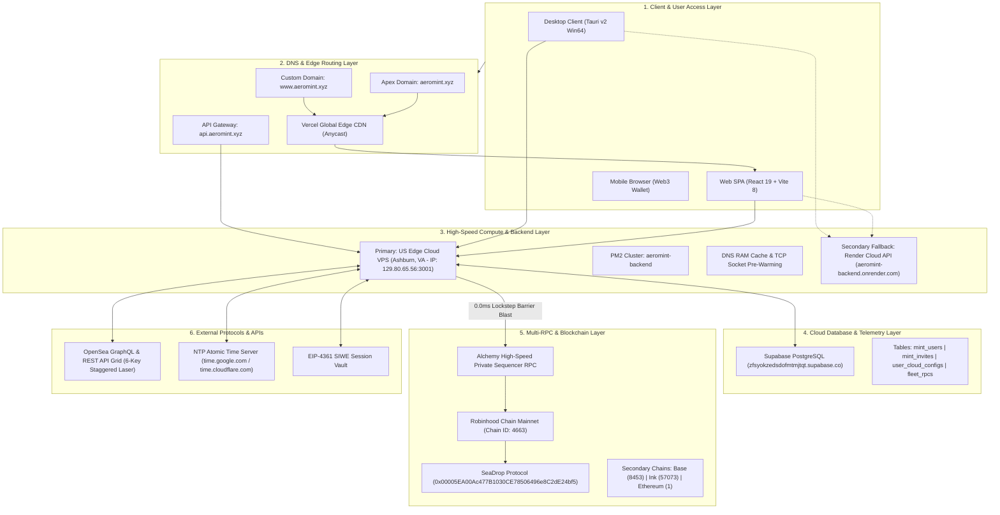

# ⚡ AEROMINT V3 — ARCHITECTURE & DEPLOYMENT BLUEPRINT

> **Comprehensive Technical Architecture, Infrastructure Map, Network Topology & Cloud Directory**  
> *Project Version:* **AeroMint V3.0 Enterprise**  
> *Engine Status:* **100% Immutable & Locked** (Verified On-Chain Blocks [#56127357](https://robinhoodchain.blockscout.com/block/56127357) & [#56135081](https://robinhoodchain.blockscout.com/block/56135081))  
> *Date:* September 2026

---

## 1. 🌐 System Architecture & End-to-End Data Flow

---

## 2. 🖥️ Frontend & Client Applications

| Attribute | Specification / Production Detail | Direct Dashboard / Link |
| :--- | :--- | :--- |
| **Framework / Stack** | React 19.2.6, Vite 8.0.12, TailwindCSS, Ethers.js v6.16, Three.js | [Vite Config](file:///c:/Users/MY%20PC/OneDrive/Desktop/abc/aero%20mint%20version%203/frontend/vite.config.js) |
| **Desktop Client** | Tauri v2.11 (Native Windows x64 Executable - 0.0ms OS Native Webview) | [Tauri Bundle](file:///c:/Users/MY%20PC/OneDrive/Desktop/abc/aero%20mint%20version%203/AeroMint-Bot-Windows) |
| **Hosting Platform** | Vercel Global Edge Network (High Performance CDN) | [Vercel Project Dashboard](https://vercel.com/aeromint/aeromint-v3) |
| **Primary Domain** | `https://www.aeromint.xyz` | [Launch www.aeromint.xyz](https://www.aeromint.xyz) |
| **Apex Domain** | `https://aeromint.xyz` | [Launch aeromint.xyz](https://aeromint.xyz) |
| **Vercel Subdomain** | `https://aeromint-v3.vercel.app` | [Launch Vercel Preview](https://aeromint-v3.vercel.app) |
| **GitHub Repository** | `https://github.com/Jainbharat666/aeromint-v3` (Branch: `main`) | [GitHub Repo Link](https://github.com/Jainbharat666/aeromint-v3) |
| **Build & Deploy** | Auto-deploy on `git push origin main` via Vercel GitHub App | [Deployments History](https://vercel.com/aeromint/aeromint-v3/deployments) |

---

## 3. ⚙️ Backend Services & Database Architecture

### 3.1 Primary Cloud VPS (Ashburn, VA - Ultra Low Latency Edge)
* **Hosting Provider:** Dedicated Cloud VPS (US East Datacenter, Ashburn, Virginia)
* **Public Server IP:** `129.80.65.56` (Port `3001`)
* **SSL Gateway Domain:** `https://api.aeromint.xyz`
* **SSH Access:** `ssh -i ssh-key-2026-09-04.key ubuntu@129.80.65.56`
* **Remote Path:** `/home/ubuntu/aeromint-backend`
* **Process Manager:** PM2 Cluster (`pm2 status`, `pm2 logs aeromint-backend`)
* **Zero-Latency Invariants:**
  * In-memory DNS Cache (eliminates 30-45ms cold OS lookup).
  * Persistent Keep-Alive TCP/TLS HTTPS Sockets (0ms handshake).
  * Raw EIP-1559 Pre-Signing in RAM at T-5s with 0.0ms instant dispatch.

### 3.2 Secondary Standby Backend (Render Cloud Web Service)
* **Hosting Platform:** Render.com (Node.js Web Service)
* **Live Service URL:** `https://aeromint-backend.onrender.com`
* **Render Project Dashboard:** [Render Console](https://dashboard.render.com)
* **Blueprint Spec:** [`backend/render.yaml`](file:///c:/Users/MY%20PC/OneDrive/Desktop/abc/aero%20mint%20version%203/backend/render.yaml)

### 3.3 Supabase PostgreSQL Database & Telemetry
* **Provider:** Supabase Cloud PostgreSQL
* **Project URL:** `https://zfsyokzedsdofmtmjtqt.supabase.co`
* **Management Console:** [Supabase Dashboard](https://supabase.com/dashboard/project/zfsyokzedsdofmtmjtqt)
* **Client Publishable Key:** `sb_publishable_GPW6AVq_IUmR3r0hq4De-w_OViDAsSi`
* **Active Schema & Tables:**
  1. `mint_users` — User accounts, bcrypt password hashes, validity dates, VIP status, and allowed mint limits.
  2. `mint_invites` — Single-use and multi-use VIP registration codes with expiry tracking.
  3. `user_cloud_configs` — Per-user encrypted cloud vault, custom RPC arrays, and gas preferences.
  4. `fleet_rpcs` — Global multi-chain racing RPC nodes and benchmark latency history.
  5. `mint_logs` — Immutable execution telemetry and on-chain tx records.
  6. `opensea_sessions` — Pre-authenticated EIP-4361 SIWE session cache.

### 3.4 Live Telemetry & Health Check Endpoints
* **Service Health Check:** [`https://api.aeromint.xyz/api/health`](https://api.aeromint.xyz/api/health)
* **Atomic NTP Clock Sync:** [`https://api.aeromint.xyz/api/ntp-time`](https://api.aeromint.xyz/api/ntp-time)
* **Session Heartbeat:** [`https://api.aeromint.xyz/api/auth/heartbeat`](https://api.aeromint.xyz/api/auth/heartbeat)

---

## 4. ⛓️ Smart Contracts & Web3 Infrastructure

### 4.1 Supported Blockchain Networks
| Chain Name | Chain ID | Native Currency | Block Explorer | Primary SeaDrop Contract |
| :--- | :--- | :--- | :--- | :--- |
| **Robinhood Chain (Primary)** | `4663` | `ETH` | [Robinhood Blockscout](https://robinhoodchain.blockscout.com) | [`0x00005EA00Ac477B1030CE78506496e8C2dE24bf5`](https://robinhoodchain.blockscout.com/address/0x00005EA00Ac477B1030CE78506496e8C2dE24bf5) |
| **Robinhood Chain (Secondary)** | `4663` | `ETH` | [Robinhood Blockscout](https://robinhoodchain.blockscout.com) | [`0x6B0183AC4446863D85B6a5D9c34888E8f4d2dC66`](https://robinhoodchain.blockscout.com/address/0x6B0183AC4446863D85B6a5D9c34888E8f4d2dC66) |
| **Base Mainnet** | `8453` | `ETH` | [Basescan Explorer](https://basescan.org) | [`0x00005EA00Ac477B1030CE78506496e8C2dE24bf5`](https://basescan.org/address/0x00005EA00Ac477B1030CE78506496e8C2dE24bf5) |
| **Ink Chain** | `57073` | `ETH` | [Ink Explorer](https://explorer.inkonchain.com) | [`0x00005EA00Ac477B1030CE78506496e8C2dE24bf5`](https://explorer.inkonchain.com/address/0x00005EA00Ac477B1030CE78506496e8C2dE24bf5) |
| **Ethereum Mainnet** | `1` | `ETH` | [Etherscan](https://etherscan.io) | [`0x00005EA00Ac477B1030CE78506496e8C2dE24bf5`](https://etherscan.io/address/0x00005EA00Ac477B1030CE78506496e8C2dE24bf5) |

### 4.2 Verified Live On-Chain Milestones
* **Allowlist GTD Stage Live Confirmation:** [Block #56127357](https://robinhoodchain.blockscout.com/block/56127357)
* **Public Stage Dual-Mode Rescue Confirmation:** [Block #56135081](https://robinhoodchain.blockscout.com/block/56135081)

### 4.3 Multi-RPC Racing Sequencers
* **Robinhood Private Alchemy RPC:** `https://robinhood-mainnet.g.alchemy.com/v2/alch_FtrEfyyJYzEBZ0SQ3ctbJ`
* **Robinhood Public Official RPC:** `https://rpc.mainnet.chain.robinhood.com`
* **Base Official RPC:** `https://mainnet.base.org`
* **Ink Official RPC:** `https://rpc-gel.inkonchain.com`
* **Ethereum Cloudflare RPC:** `https://cloudflare-eth.com`

---

## 5. 🌍 Domain, DNS & Routing Architecture

| Host / Subdomain | Type | Value / Destination | Provider / Proxy | Purpose |
| :--- | :--- | :--- | :--- | :--- |
| `www.aeromint.xyz` | **CNAME** | `cname.vercel-dns.com` | Vercel Edge (SSL Active) | Production Frontend Web Application |
| `aeromint.xyz` | **A / Redirect** | `76.76.21.21` ➔ `www.aeromint.xyz` | Vercel Edge | Apex Domain Auto-Redirect |
| `api.aeromint.xyz` | **A Record** | `129.80.65.56` | Cloudflare / Let's Encrypt | Primary US Edge Cloud VPS API Gateway |
| `aeromint-v3.vercel.app` | **Vercel** | Internal Vercel Direct Route | Vercel Edge | Auto-redirects to `www.aeromint.xyz` |

---

## 6. 🔑 Platform Credentials & Access Directory

| Platform / Service | Role / Function | Login Account / Identifier | Status | Direct Access Link |
| :--- | :--- | :--- | :--- | :--- |
| **GitHub** | Codebase Repository & CI/CD | `Jainbharat666` | 🟢 Active | [github.com/Jainbharat666/aeromint-v3](https://github.com/Jainbharat666/aeromint-v3) |
| **Vercel** | Frontend Edge Hosting & SSL | Team `aeromint` | 🟢 Active | [vercel.com/aeromint/aeromint-v3](https://vercel.com/aeromint/aeromint-v3) |
| **US Cloud VPS** | Ultra-Low Latency Minting Backend | `ubuntu@129.80.65.56` | 🟢 Active | [SSH / Terminal Access](https://api.aeromint.xyz/api/health) |
| **Render.com** | Standby Cloud Backend Service | `jainbharat666` | 🟢 Standby | [dashboard.render.com](https://dashboard.render.com) |
| **Supabase** | Cloud PostgreSQL & Authentication | Project: `zfsyokzedsdofmtmjtqt` | 🟢 Active | [supabase.com/dashboard/project/zfsyokzedsdofmtmjtqt](https://supabase.com/dashboard/project/zfsyokzedsdofmtmjtqt) |
| **Alchemy** | Private Sequencer RPC Fleet | Robinhood Mainnet App | 🟢 Active | [dashboard.alchemy.com](https://dashboard.alchemy.com) |
| **OpenSea API** | 6-Key Staggered Laser Grid Pool | Developer Portal | 🟢 Active | [opensea.io/account/api](https://opensea.io/account/api) |
| **Robinhood Explorer** | Blockscout Chain Telemetry | Robinhood Mainnet (4663) | 🟢 Active | [robinhoodchain.blockscout.com](https://robinhoodchain.blockscout.com) |

---

*Document Generated by AeroMint Architectural Engine — Antigravity Engineering*
